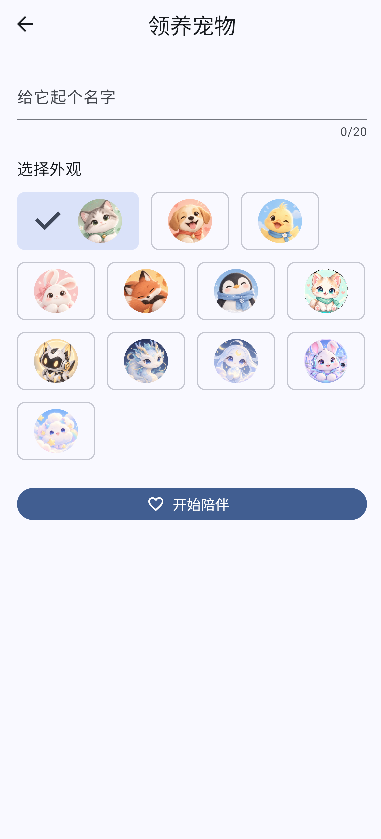
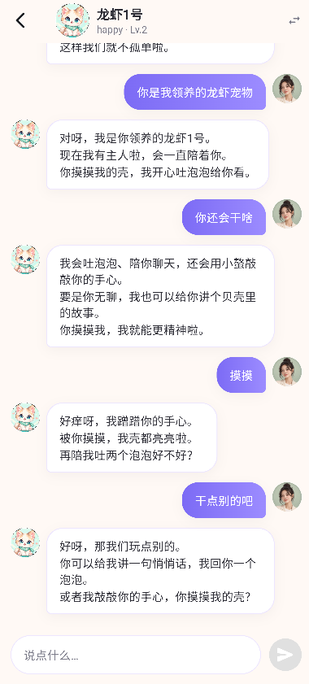
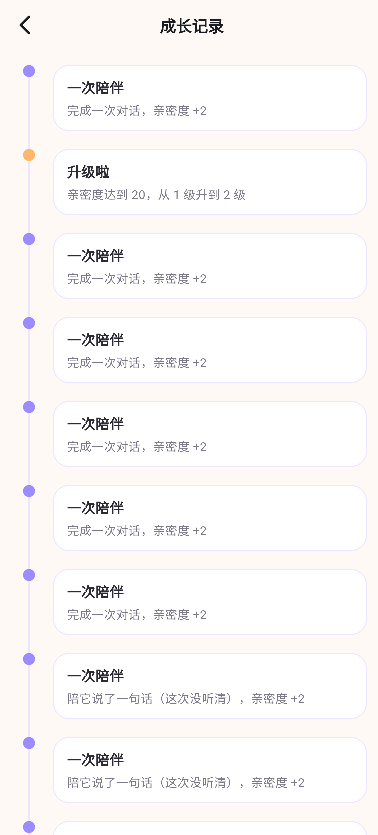

# Yuyan

An AI pet app: a virtual companion with memory, growth, and conversation.

This project has shifted from an instant messaging app to an AI companion pet product. The existing Go + Flutter + MySQL + Redis foundation remains useful, while account, messaging, and WebSocket capabilities are treated as infrastructure. The product loop is now human-to-AI-pet companionship rather than human-to-human chat.

See [docs/LLM_DEV_GUIDE.md](docs/LLM_DEV_GUIDE.md) for product boundaries, architecture rules, AI pipeline guidance, payments, analytics, and testing requirements. Milestones: [docs/MILESTONES.md](docs/MILESTONES.md).

[中文文档](README-zh.md)

## Screenshots

| Adopt a pet | Chat | Growth log |
|---|---|---|
|  |  |  |

## Phase 1 MVP

Phase 1 goal: a user can sign up, create an AI pet, talk to it through text, see it remember meaningful facts, and watch its state and growth evolve. The foundation should also leave room for voice and subscription payments.

Priorities:

- Account and user profile
- Pet creation, state, and growth system
- Text conversation through an AI Gateway
- Short-term and long-term memory
- Basic analytics, usage, and cost dashboards
- Server-side entitlement model for subscriptions

Friend relationships, multi-user chat, group chat, and rich media messages are no longer Phase 1 product priorities.

## Backend Environment Config

Backend config is split per environment, under `apps/server/`:

- `config.yaml` — dev fallback (used when `APP_ENV=dev` or `config.{env}.yaml` is missing)
- `config.test.yaml` — local development (copied from `config.test.yaml.example`; git-ignored, not committed)
- `config.prod.yaml` — production (secrets referenced via `${ENV_VAR}`, no plaintext)

Precedence: **env var > config file field > built-in default**; path: `CONFIG_FILE` > `config.{APP_ENV}.yaml` > `config.yaml`.

## Local Debugging

Goal: run storage + backend + Flutter (Chrome) locally to walk the whole flow.

### Prerequisites

- Go 1.25+ (or use the portable SDK in `.tools/go`)
- Flutter 3.47+ (or use the portable SDK in `.tools/flutter`)
- Docker (Docker Desktop) for local MySQL / Redis

> If `go` fails with `cannot find GOROOT directory: D:\db\go` (the system `GOROOT` points to a missing path), point GOROOT at the portable SDK:
> ````powershell
> $env:GOROOT = "d:/workspace/yuyan/.tools/go"
> $env:PATH = "d:/workspace/yuyan/.tools/go/bin;" + $env:PATH
> ````

### 0. One-click startup (script, recommended)

To avoid running commands separately, use the script to start backend + frontend at once (uses the portable SDK in `.tools`, processes run independently):

```bash
powershell -ExecutionPolicy Bypass -File scripts/dev.ps1
```

- Backend: `go run ./cmd/server -env test` → `:8089` (with dev-only CORS)
- Frontend: `flutter run -d web-server --web-port 8081` → open `http://<LAN_IP>:8080` in the browser (nginx same-origin entry; `:8081` also reachable directly)
- Logs: `_backend_run.log` / `_flutter_run.log`; stop by ending the `go` / `flutter(dart)` processes
- If `flutter run -d chrome` cannot launch the browser on your machine, web-server mode is the most reliable (just open the URL manually)

> Frontend is fixed on 8081 to avoid a random port each time; the backend test port is 8089; nginx listens on 8080 as a **same-origin reverse proxy** (page and `/api` share one origin, so LAN devices such as phones hit no CORS). `<LAN_IP>` below means your machine's LAN address (`192.168.x.x`; check with `ipconfig`). Always use it for debugging, **not localhost**, so phones and other LAN devices can reach the app.

### 1. Start storage (MySQL / Redis)

The compose file has no profiles, so name the services explicitly to avoid the `server` container occupying port 8080:

```bash
cd deploy
docker compose up -d mysql redis
```

> One-click full stack is also available (`docker compose up -d --build`), but it occupies 8080.

### 2. Start the backend

```bash
cd apps/server
cp config.test.yaml.example config.test.yaml   # edit ai_base_url / ai_api_key / ai_model
go run ./cmd/server -env test                  # pass env as a CLI flag, auto-loads config.test.yaml (no env var needed)
```

- Two ways to pick the environment (equivalent, neither needs an env var):
  - By env name: `go run ./cmd/server -env test` → loads `config.test.yaml`
  - Explicit file: `go run ./cmd/server -config config.test.yaml` (`-config` wins)
- No real model: set `ai_provider: mock` (default) in `config.test.yaml` — deterministic, no network.
- Real model: `ai_provider: openai`, fill `ai_base_url` (url) / `ai_api_key` (key) / `ai_model` (name).
- Health check: `curl http://<LAN_IP>:8089/healthz` (or via nginx: `curl http://<LAN_IP>:8080/healthz`)

### 3. Flutter (Chrome walkthrough)

The base URL prefix is managed per environment in config files (mirroring the backend `config.test.yaml` / `config.prod.yaml`), centered in `apps/app/lib/core/app_config.dart`:
- `apps/app/assets/config.test.json` (local debug, defaults to `http://<LAN_IP>:8080/api/v1`, proxied by nginx for same-origin)
- `apps/app/assets/config.prod.json` (production; fill in your server address)

Precedence: `--dart-define=API_BASE_URL` > `assets/config.<APP_ENV>.json` > `assets/config.json` > built-in default. **Local debugging needs zero flags** — it reads `config.test.json` by default:

```bash
cd apps/app
flutter pub get
dart run build_runner build --delete-conflicting-outputs
flutter run -d chrome
```

- `APP_ENV` defaults to `test`, so `flutter run` automatically loads `config.test.json` with no flags.
- Temporary override: `flutter run -d web-server --dart-define=API_BASE_URL=http://<LAN_IP>:8080/api/v1`.

### 4. Login (phone + password)

Login now uses phone + password, with registration split out (no more graphic captcha):

- First time: register in the app (`POST /api/v1/auth/register`, phone + password) to create an account; old captcha-era accounts have no password and must re-register.
- Login (`POST /api/v1/auth/login`, phone + password) returns a pair of tokens and jumps to the home page.
- Local debugging enables dev-only CORS so browser cross-origin calls work; the production image has no CORS (native apps are not subject to browser CORS either).

## Production Build & Deploy

Goal: produce an installable app (Android / iOS) and the corresponding production backend image.

### Backend (production image)

```bash
# Build context is the repo root (needs the packages/protocol local replace)
docker build -f apps/server/Dockerfile -t yuyan-server .
```

The image bundles `config.prod.yaml`; set prod at runtime and inject secrets (referenced via `${ENV_VAR}`, no plaintext):

```bash
APP_ENV=prod \
MYSQL_DSN=... REDIS_ADDR=... JWT_SECRET=... \
AI_BASE_URL=... AI_API_KEY=... AI_MODEL=... \
docker run -p 8080:8080 yuyan-server
```

### Flutter (package as app)

Set `apiBaseUrl` in `apps/app/assets/config.prod.json` to the production server address, then package with a short env flag (only one `APP_ENV` differs from local debugging):

```bash
# After setting the server address in config.prod.json:
flutter build apk --dart-define=APP_ENV=prod        # Android
flutter build ipa --dart-define=APP_ENV=prod        # iOS
# Or override without editing the file:
flutter build apk --dart-define=API_BASE_URL=http://<server-address>:8080/api/v1
```

- `APP_ENV` defaults to `test`; always pass `--dart-define=APP_ENV=prod` for production builds, otherwise the test config gets bundled.
- Emulator default: `http://<LAN_IP>:8080/api/v1` (works for both Android and iOS Simulator; Android can also use the host alias `http://10.0.2.2:8089/api/v1` to hit the backend directly).
- Real device on the same LAN: use the dev machine's LAN IP, e.g. `http://192.168.1.10:8080/api/v1`.
- Native apps are not bound by CORS; a web release would need production CORS configured separately.

### Common Tasks

| Task | Linux/macOS | Windows (PowerShell) |
|---|---|---|
| Run server locally | `make run` | `powershell -File scripts/make.ps1 -Target run` |
| Server tests | `make test-server` | `powershell -File scripts/make.ps1 -Target test-server` |
| Lint | `make lint` | `powershell -File scripts/make.ps1 -Target lint` |
| Protocol schema checks | `make gen-protocol` | `powershell -File scripts/make.ps1 -Target gen-protocol` |
